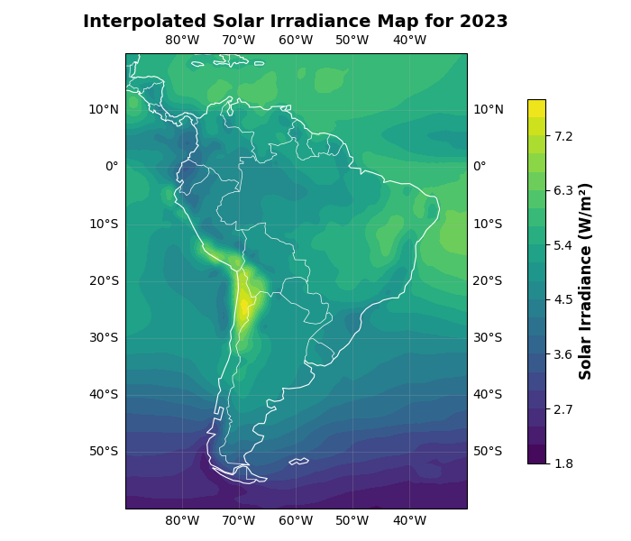
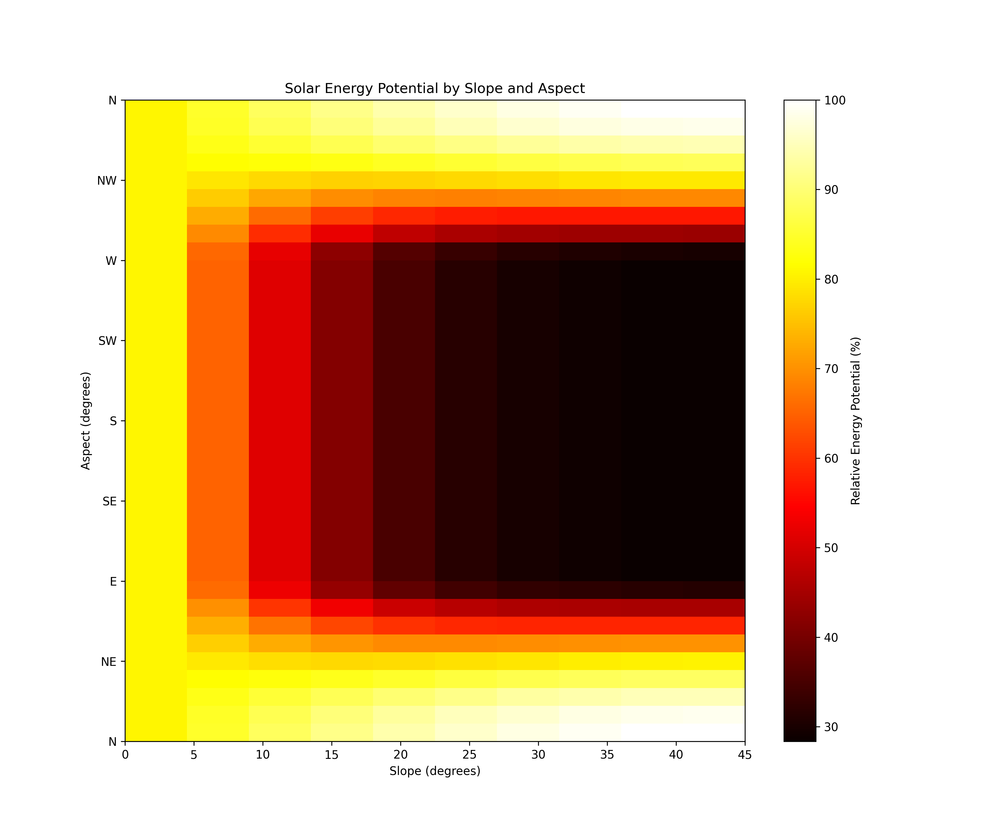
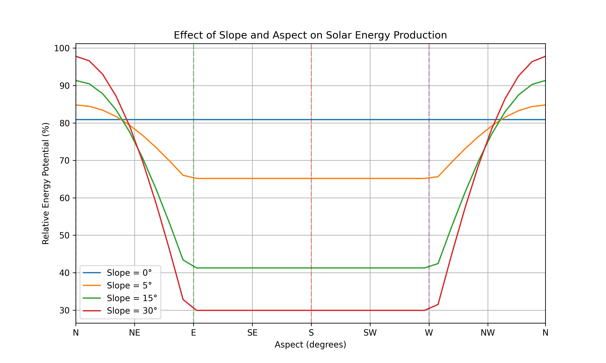

# SoLatAm 🌞


## AI-Powered Renewable Energy Transition Platform for LATAM Communities

> Empowering Latin American communities with AI-driven tools to transition from fossil fuels to renewable energy solutions.



## 🌟 Problem

Many rural and semi-urban communities in Latin America rely on expensive, polluting diesel/oil generators due to unreliable grid access. Transitioning to renewables faces significant challenges:

- **Unclear viability**: Lack of technical expertise to assess renewable potential
- **High upfront costs**: Fear of investing without guaranteed returns
- **Skill gaps**: No local capacity to install/maintain systems
- **Information asymmetry**: Difficulty accessing reliable data and expert analysis

## 💡 Solution

SoLatAm is an AI-driven platform that empowers communities to transition to renewables through three integrated components:

### 1. Viability Assessment Tool
- **Interactive Mapping**: Select locations and analyze solar potential with precision
- **Terrain Analysis**: Evaluate slope, aspect, and other geographical features
- **Cost-Benefit Calculator**: Project ROI timelines and compare to fossil fuel costs
- **NASA Data Integration**: Leveraging NASA POWER API for reliable solar irradiance data

### 2. Visual Analysis & AI Assistant
- **Image Recognition**: Upload images of potential installation sites for expert assessment
- **Multilingual Assistant**: Get answers to technical questions in Spanish and other languages
- **Voice Interaction**: Use voice commands for accessibility in low-literacy contexts

### 3. Community Collaboration Hub
- **Knowledge Exchange**: Forums and resource libraries to share experiences
- **Local Workforce Marketplace**: Connect with trained technicians in your area
- **Progress Tracking**: Measure community-wide impact and achievements

## 🛠️ Technical Architecture

SoLatAm combines several components:

1. **Data Processing Pipeline**:
   - NASA POWER API integration for solar irradiance data
   - Geographic terrain analysis (slope, aspect calculations)
   - Energy production potential modeling

2. **AI Services**:
   - OpenAI-powered multilingual chatbot
   - Computer vision for solar installation analysis
   - Voice recognition for accessibility

3. **Interactive Interfaces**:
   - Streamlit-based web application
   - Interactive maps with Folium
   - Data visualizations with Matplotlib

## 📊 Key Features

### Solar Potential Mapping

Our platform uses advanced algorithms to analyze terrain characteristics, such as slope and aspect, and solar irradiance data to create detailed solar potential maps:


### Panel Orientation Advisor

For optimal solar panel installation, this feature computes the ideal tilt angle and direction based on your location’s latitude:

<div style="text-align: center;">
    
    
</div>

### Visual Installation Analysis

Users can upload images of their sites or existing installations for AI-powered analysis:

## Installation and Setup

### Prerequisites
- Python 3.8+
- Pip package manager

### Installation Steps

1. Clone the repository:
```bash
git clone https://github.com/marc-herrero/UAB-the-hack25.git
cd UAB-the-hack25
```
